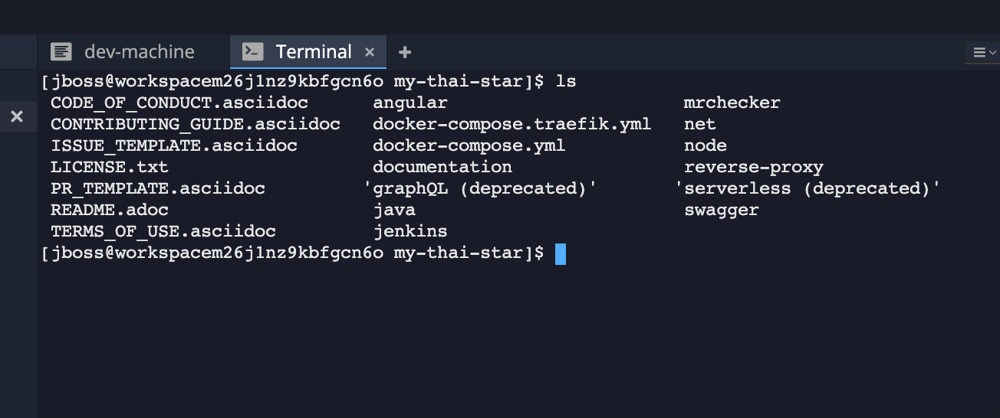
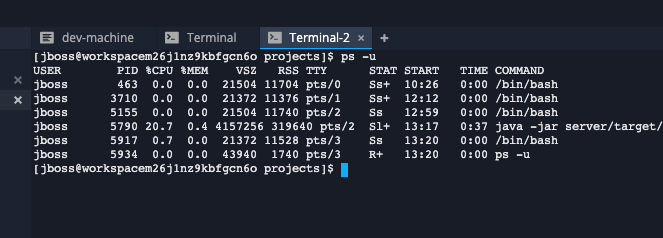

# Lab 1 - A first build

### Terminal Window of CodeReady Workspaces

For the rest of the workshop, anytime you need to run a command in a terminal, you can use the CodeReady Workspaces *Terminal* window.




### Explore OpenShift with OpenShift CLI

In order to login, `issue the following command` and log in as `$OPENSHIFT_USER @ $OPENSHIFT_PASSWORD`

```bash
  $ oc login $OPENSHIFT_CONSOLE_URL
```

Congratulations, you are now authenticated to the OpenShift server.

OpenShift ships with a web-based console that will allow users to
perform various tasks via a browser.  To get a feel for how the web console
works, open your browser and go to *$OPENSHIFT_CONSOLE_URL*.

The first screen you will see is the authentication screen. Enter your username and password (`$OPENSHIFT_USER @ $OPENSHIFT_PASSWORD`) and 
then log in. After you have authenticated to the web console, you will be presented with a
list of projects that your user has permission to work with. 


### Prepare Maven

Open `my-thai-star/java/mtsj/pom.xml`. Add `snippets/pom.xm` (from project *my-thai-star-workshop*) to the end of project's pom.xml file. 

In the terminal window:

```bash
cd
cd .m2
vi settings.xml
```

Insert `snippets/settings.xml` and save the new file (ESC :wq). Switch back to the project location:

```bash
cd /projects/my-thai-star
```

Switch to the java component`s root location:

```bash
cd java/mtsj
```

### Build the app

```shell
mvn install -DskipTests=true
```

### Deploy the artifacts

```shell
mvn deploy -DskipTests=true
```

### Launch the app

Launch the app within the workspace:

```bash
java -jar server/target/mythaistar-bootified.war
```

You can now wath the Spring Boot application spin up.

#### How to terminate the app?

The easiest way to terminate the app is to kill it's process. Open a `open a second terminal` by clicking on the '+' next the current terminal window:

```bash
ps -u | grep java
````



Copy the PID and kill the process:

```bash
kill -9 <PID>
```
