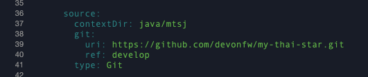

## Lab 3 - Builds and Deployments using Templates

### Create a new project

Using the terminal, create a new project:

```bash
oc new-project mythaistar-userXY
```

where `XY` is your user's number.

### Using Templates

A template describes a set of objects that can be parameterized and processed to produce a list of objects for creation by OpenShift Container Platform. A template can be processed to create anything you have permission to create within a project, for example services, build configurations, and deployment configurations. A template may also define a set of labels to apply to every object defined in the template.

You can create a list of objects from a template using the CLI or, if a template has been uploaded to your project or the global template library, using the web console.

#### Uploading a Template

If you have a JSON or YAML file that defines a template, you can upload the template to projects using the CLI. This saves the template to the project for repeated use by any user with appropriate access to that project.

#### Prepare the Templates before uploading

In the workspace, open template `templates/build-mythaistar` and search for the git reference:



Replace `uri:` with `$GOGS_REPO_URL`

Next, switch to the `my-thai-star-workshop` directory:

```bash
cd /projects/my-thai-star-workshop/
```

Upload the Build-template using the CLI:

```bash
oc create -f templates/build-mythaistar-java.yaml
```

Verify that the build is running.

Upload the Deployment-template using the CLI:

```bash
oc create -f templates/deploy-mythaistar-java.yaml
```

Once the build is finished, the app will be automatically deployed.

