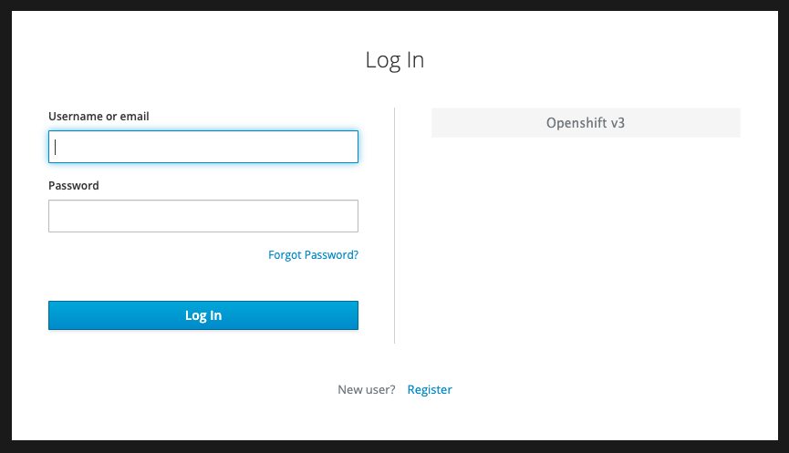
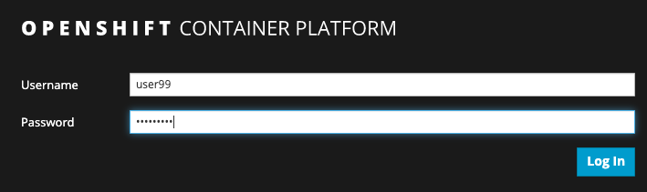
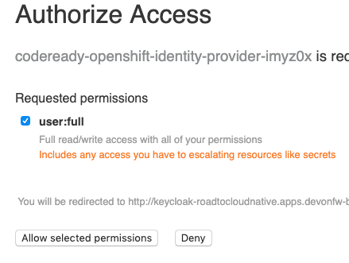
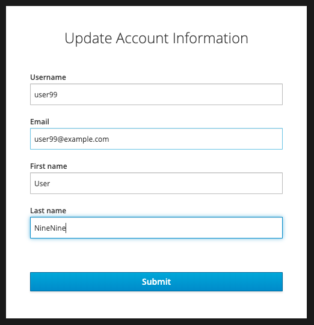
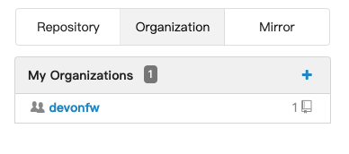
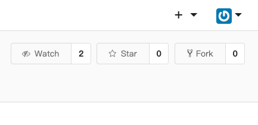
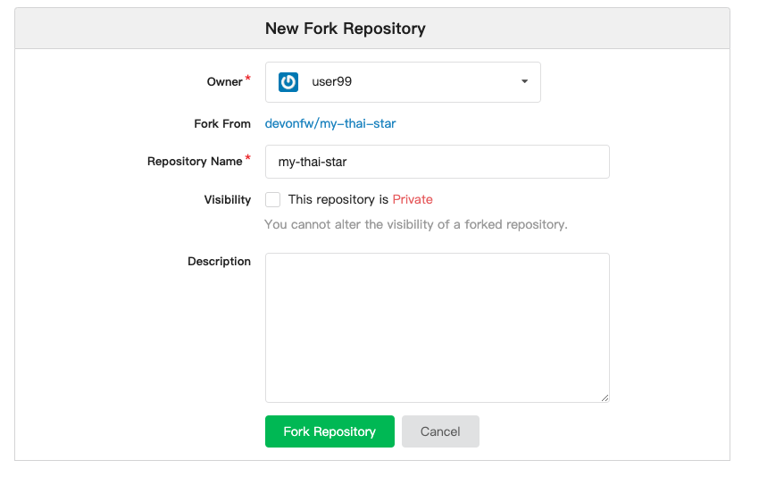
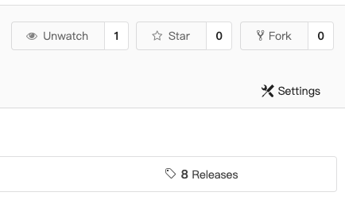
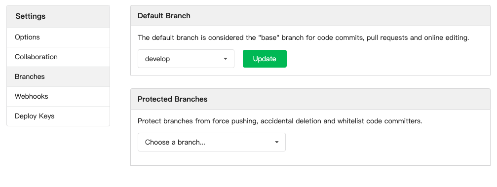

# Setup the development environment

### What is CodeReady Workspaces?

[Red Hat CodeReady Workspaces](https://developers.redhat.com/products/codeready-workspaces/overview/) is a collaborative Kubernetes-native development platform that delivers OpenShift workspaces and an IDE for rapid cloud application development.

Built on the open Eclipse Che project, [Red Hat CodeReady Workspaces](https://developers.redhat.com/products/codeready-workspaces/overview/) provides developer workspaces on OpenShift with all the tools and the dependencies that are needed to code, build, test, run, and debug containerized applications. The entire product runs in the cloud and eliminates the need to install anything on a local machine.

* It offers fast onboarding capabilities for teams with powerful collaboration, workspace automation, and management at scale
* It removes inconsistencies and the “works on my machine” syndrome
* It protects source code from the hard-to-secure developer and personal laptops

### Logging in to CodeReady Workspaces

Go to *$CODEREADY_WORKSPACES_URL*, then click on *'Openshift v3'* to log in through [OpenShift OAuth](https://docs.openshift.com/container-platform/3.11/architecture/additional_concepts/authentication.html#oauth){:target="_blank"}.

Log in as `$OPENSHIFT_USER @ $OPENSHIFT_PASSWORD`

and click on `'Allow selected permissions'`

Finally, `enter your account information` and `click on 'Submit'`

Once logged into CodeReady Workspaces, you can now create your workspace based on the *Java 1.8 Stack*.

### Create your own codebase

Go to *$GOGS_URL*, then click *'Sign In'*.

Log in as `$OPENSHIFT_USER @ $OPENSHIFT_PASSWORD`

Navigate to the `devonfw` organization.

Select the `devonfw / my-thai-star` repository and *fork* it.

To switch the default branch to `develop`, click `Settings` and then navigate to `Branches`.

Click `Update` to save your changes.

### Next steps

[Create a workspace](workspace.md)