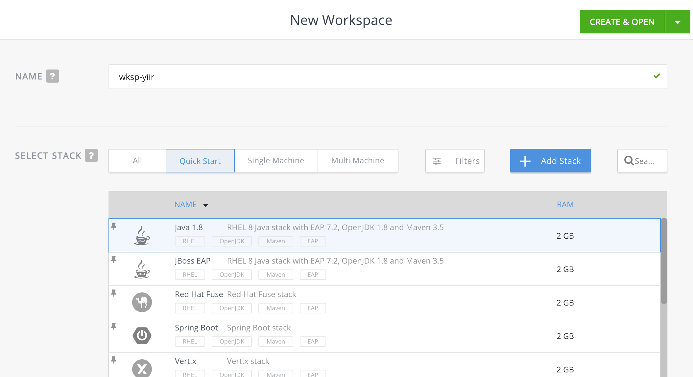
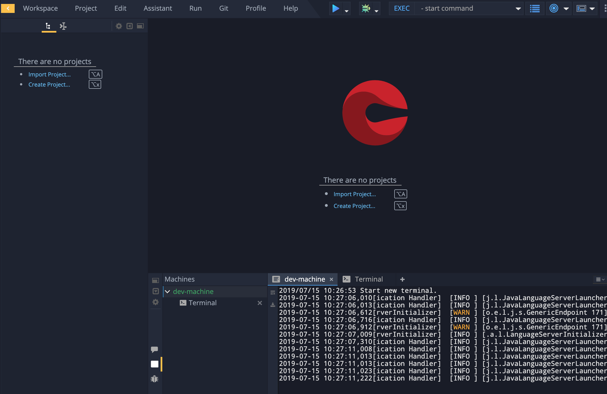
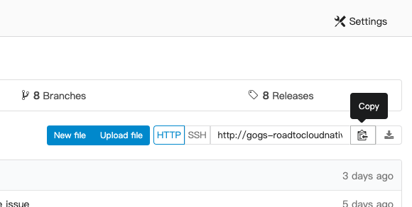
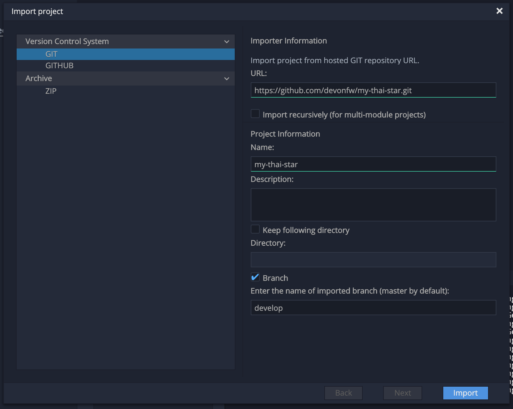
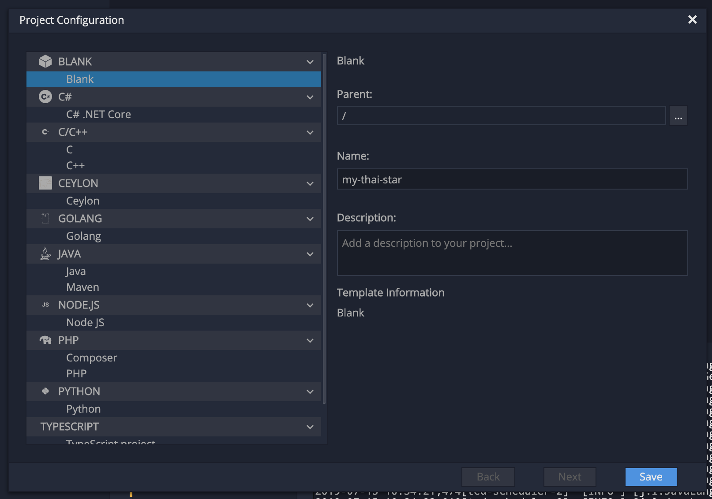

# Create a workspace

Once logged into CodeReady Workspaces, you can now create your workspace based on the *Java 1.8 Stack*.

A **Stack** is a template for workspace configuration. It includes the programming language and tools needed in your workspace to create applications. 
Stacks make it possible to deploy identical workspaces for all users on demand.

`Select the stack called 'Java 1.8'` and then `click on 'CREATE & OPEN'`. 

It takes a little while for the workspace to be ready. When it's ready, you will see a fully functional CodeReady Workspaces IDE running in your browser.

### Importing the My-Thai-Star reference app

Now you can import the newly forked My Thai Star reference app into your workspace. First, navigate to the repository and copy it's URL:

The repositorie's URL you just copied will be referenced as `$GOGS_REPO_URL` in the docs.

In the Project Explorer pane, `click on 'Import Project...'` and enter the following:

  * Type: **GIT**
  * URL: **$GOGS_REPO_URL**
  * Name: **my-thai-star**
  * Check **Branch**. User branch `develop`

`Click on 'Import'`. Make sure you choose the **Blank** project configuration since the repository contains multiple project skeletons. `Click on 'Save'`

### Importing the workshop assets

You will need certain assets (e.g. code snippets) later in the workshop. Import the workshop repository following the same steps as above into your workspace.

In the workspace, `click on 'Workspace - Import Project...'` and enter the following:

  * Type: **GIT**
  * URL: **https://github.com/redhat-capgemini-exchange/my-thai-star-workshop.git**
  * Name: **my-thai-star-workshop**

Now you are ready to get started with the labs!

### Next steps

[Lab 1 - A first build](lab1.md)