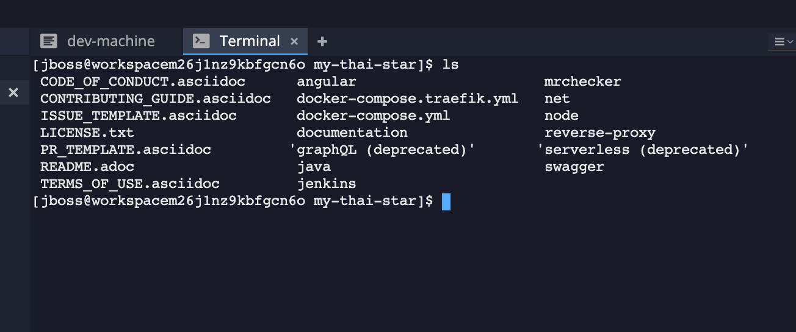

# Create a workspace

Once logged into CodeReady Workspaces, you can now create your workspace based on the *Java 1.8 Stack*.

A **Stack** is a template for workspace configuration. It includes the programming language and tools needed in your workspace to create applications. 
Stacks make it possible to deploy identical workspaces for all users on demand.

`Select the stack called 'Java 1.8'` and then `click on 'CREATE & OPEN'`. 


It takes a little while for the workspace to be ready. When it's ready, you will see a fully functional CodeReady Workspaces IDE running in your browser.


### Importing the lab project
Now you can import the project skeletons into your workspace.

In the Project Explorer pane, `click on 'Import Project...'` and enter the following:

  * Type: **GIT**
  * URL: [https://github.com/devonfw/my-thai-star.git](https://github.com/devonfw/my-thai-star.git)
  * Name: **my-thai-star**
  * Check **Branch**. User branch `develop`


`Click on 'Import'`. Make sure you choose the **Blank** project configuration since the repository contains multiple project skeletons. `Click on 'Save'`


### Terminal Window of CodeReady Workspaces

For the rest of these labs, anytime you need to run a command in a terminal, you can use the CodeReady Workspaces *Terminal* window.




### Explore OpenShift with OpenShift CLI

In order to login, `issue the following command` and log in as `$OPENSHIFT_USER @ $OPENSHIFT_PASSWORD`

```bash
  $ oc login $OPENSHIFT_CONSOLE_URL
```

Congratulations, you are now authenticated to the OpenShift server.

OpenShift ships with a web-based console that will allow users to
perform various tasks via a browser.  To get a feel for how the web console
works, open your browser and go to *$OPENSHIFT_CONSOLE_URL*.

The first screen you will see is the authentication screen. Enter your username and password (`$OPENSHIFT_USER @ $OPENSHIFT_PASSWORD`) and 
then log in. After you have authenticated to the web console, you will be presented with a
list of projects that your user has permission to work with. 

Now you are ready to get started with the labs!
